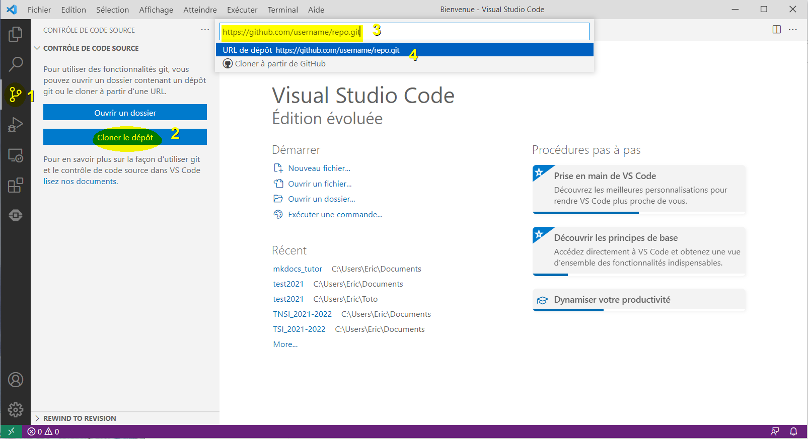

Vous disposez maintenant d'un site web généré avec le framework MkDocs et le thème Material qui est publié sur un de vos dépots GitHub.

Ceci est un tutoriel complémentaire pour développer et maintenir votre site depuis votre PC Windows 10 avec l'éditeur Visual Studio Code.


## Préparation :

Il est nécessaire d'installer **Python**, un éditeur de code et tous les modules utiles au fonctionnement de **Git** et **MkDocs** :

- Télécharger et installer (cocher la case ajouter au PATH) la dernière version de Python disponible à l'adresse : [www.python.org](https://www.python.org/downloads/) ;

- Télécharger et installer la dernière version de [Git for Windows](https://gitforwindows.org/) ;

- Télécharger et installer la dernière version de [Visual Studio Code](https://code.visualstudio.com/download) ;

Dans Visual Studio Code (VSC), ouvrir un nouveau Terminal (menu `Terminal > New Terminal`) pour saisir :
```bash
pip install mkdocs-material
pip install notebook
pip install mkdocs-jupyter
```

## La copie de travail = le clone local du dépôt distant :

- Dans Visual Studio Code (VSC), cliquer sur le bouton "Contrôle de code source" (1) (`Source Control` ++"Ctrl"+"Maj"+"G"++) ;



- Cliquer sur le bouton "Cloner le dépôt" (2), saisir l'URL du dépôt (3) puis valider (4) ;

- Choisir alors un dossier parent pour recevoir un clone local de votre dépôt distant ;

- Cliquer sur le bouton "Explorateur" (++"Ctrl"+"Maj"+"E"++), puis cliquer sur un fichier pour l'ouvrir dans l'éditeur afin d'y apporter vos modifications... ;

## Développement du site en local :

- Ouvrir un nouveau Terminal pour saisir : `mkdocs serve` ;

- Votre site est visible dans un navigateur à l'URL : `http://127.0.0.1:8000`

- Editer et modifier les fichiers de votre site dans VSC ;

> Après chaque sauvegarde dans VSC avec la combinaison de touche ++"Ctrl"+"S"++ , l'affichage de votre site se met à jour dans le navigateur...

## Maintenir votre site distant :

- Cliquer sur le bouton "Contrôle de code source" (`Source Control` ++"Ctrl"+"Maj"+"G"++) ;

- Dans "Changement" (`Changes`) cliquer sur le `+` pour ajouter les fichiers modifiés à indexer dans cette phase (stage) de développement ;

- Ajouter un message sous "CONTROLE DE CODE SOURCE" (`SOURCE CONTROL`) pour définir cette phase de développement puis cliquer sur `✓` pour valider ce commit ;

- Enfin, cliquer sur les `...` et choisir `Push` ;

> Votre site distant devrait se mettre à jour avec vos modifications après quelques temps...

