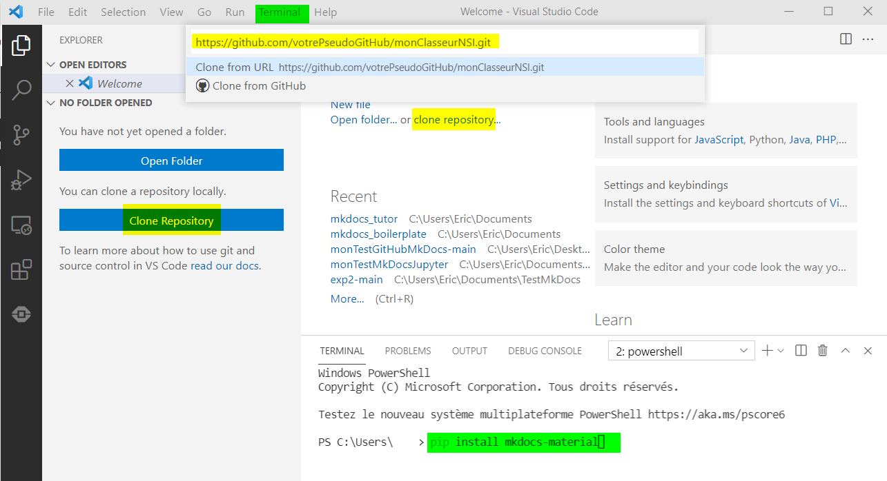

Vous disposez maintenant d'un site web généré avec le framework MkDocs et le thème Material qui est publié sur un de vos dépots GitHub (ou GitLab).

Ceci est un tutoriel complémentaire pour développer et maintenir votre site sur un PC Windows_10 et l'éditeur Visual Studio Code.


## Préparation :

Il est nécessaire d'installer Python, un éditeur de code et tous les modules utiles au fonctionnement de **MkDocs** :

- Télécharger et installer (cocher la case ajouter au PATH) la dernière version de Python disponible à l'adresse : [www.python.org](https://www.python.org/downloads/) ;
- Télécharger et installer la dernière version de [Visual Studio Code](https://code.visualstudio.com/download) ;

Dans Visual Studio Code (VSC), ouvrir un nouveau Terminal (menu `Terminal > New Terminal`) pour saisir :
```bash
pip install mkdocs-material
pip install mkdocs-jupyter
```


## Développer votre site en local :

Cliquer sur `clone repository` pour cloner votre projet à partir de l'URL de votre dépot GitHub (créer un nouveau dossier sur votre PC au nom de votre projet et ouvrir ce dossier dans VSC...) ;

Ouvrir un nouveau Terminal pour saisir : `mkdocs serve` ;

Votre site est visible dans un navigateur à l'URL : `http://127.0.0.1:8000`

Editer et modifier les fichiers de votre site dans VSC ;

Après chaque sauvegarde dans VSC avec la combinaison de touche ++"Ctrl"+"S"++ , l'affichage de votre site se met à jour dans le navigateur...

## Maintenir votre site distant :

Cliquer sur le bouton `Source Control` (++"Ctrl"+"Maj"+"G"++) ;

Dans `Changes` cliquer sur le `+` pour ajouter les fichiers modifiés à prendre en compte dans cette phase (stage) de développement ;

Ajouter un message sous `SOURCE CONTROL` pour définir cette phase de développement puis cliquer sur `✓` pour valider ce commit ;

Enfin, cliquer sur les `...` et choisir `Push` ;

Votre site distant devrait se mettre à jour avec vos modifications après quelques temps...

